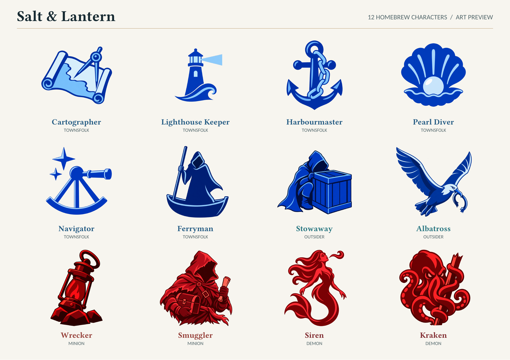

# Salt & Lantern artwork

Twelve simple character emblems generated with the built-in OpenAI image
generator for this script. The exact prompt for each character is recorded
in its `.txt` file here, including any refinement or background-removal prompts. Good characters use cobalt blue; evil characters
use crimson. These are original homebrew illustrations, not official
Blood on the Clocktower character art.

The full original 1254 × 1254 transparent PNGs are committed once, under
`app/src/main/assets/homebrew/salt-and-lantern/`. Android reads those assets
directly. The web build copies the same folder into the published site.
They remain separate from the downloaded official icon cache, so fetching
or restoring official art cannot replace them.

The final generated PNGs are preserved without resizing or re-encoding.

The homebrew Ferryman's asset is named `saltlanternferryman.png` so it cannot
replace the official Fabled Ferryman. Its prompt is `ferryman.txt`.

